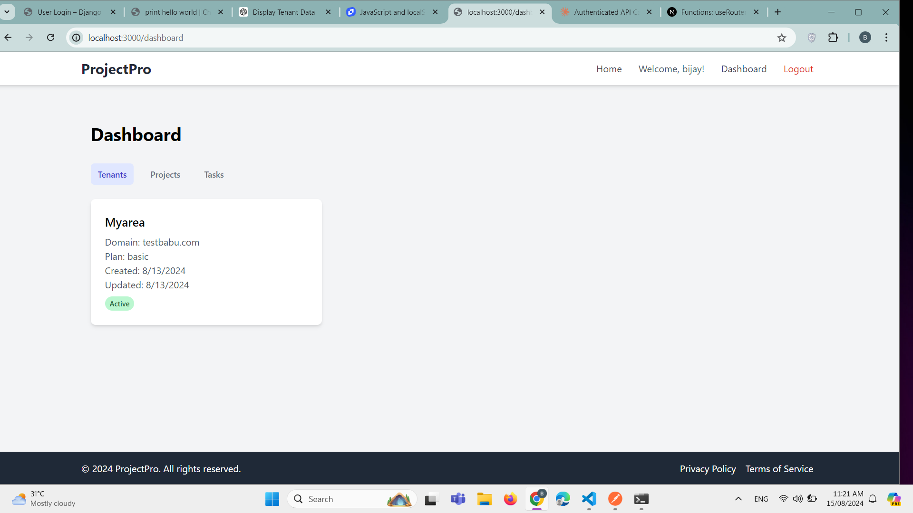
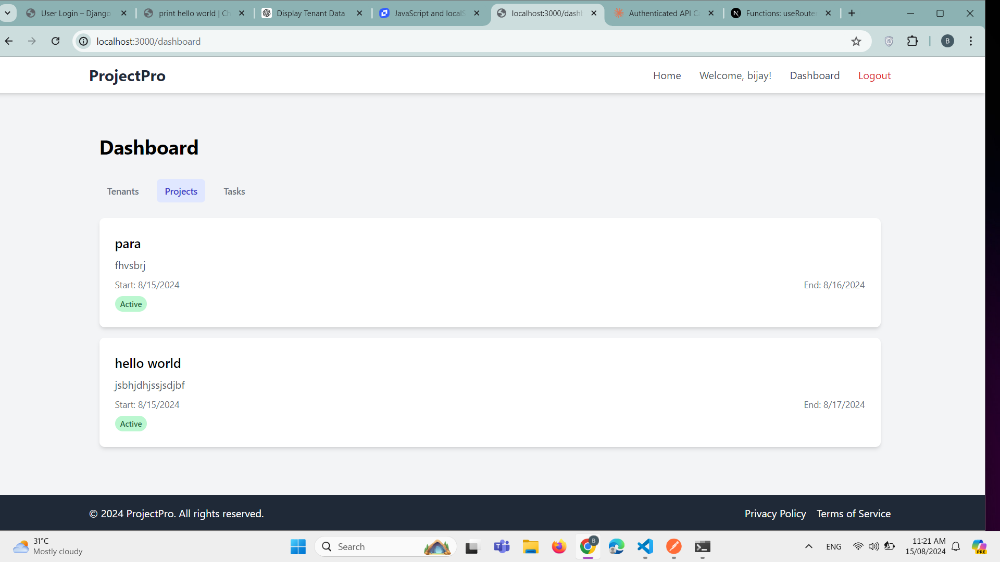
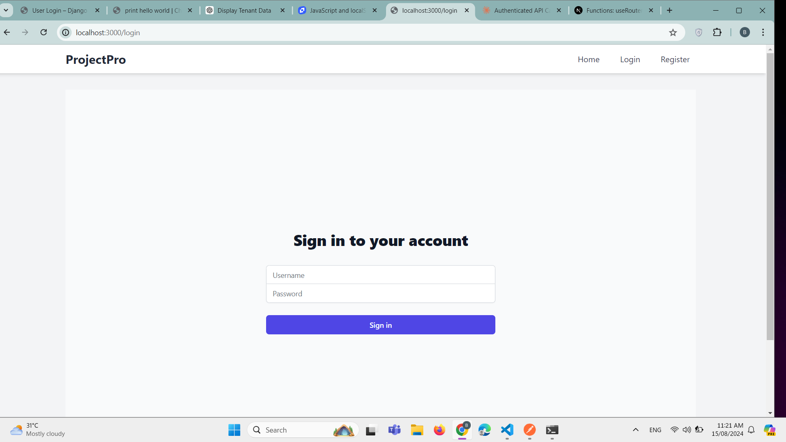
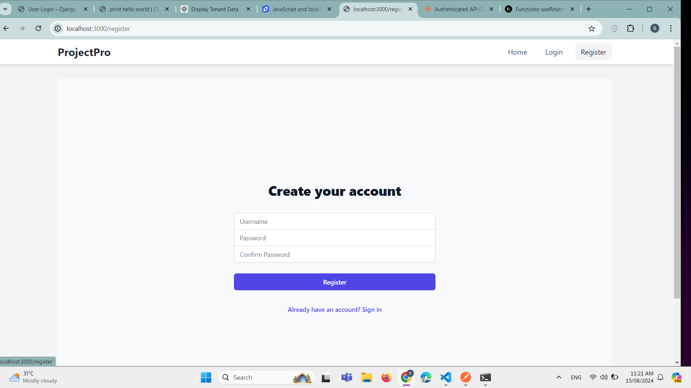

Here's an updated `README.md` file that includes instructions for setting up and running both the Django backend and the Next.js frontend:

```markdown
# ProjectPro

**Primary Function:**  
ProjectPro is a project management platform designed to help businesses, teams, and freelancers organize their projects, tasks, and team collaboration within a single, unified platform. Each business or team (tenant) gets its own isolated environment, ensuring data privacy and customizability.

## Features
- **Project Management**: Create, update, and track progress on projects.
- **Task Management**: Assign tasks to team members, set deadlines, and monitor completion.
- **Tenant Isolation**: Each tenant (business/team) has its own isolated environment, ensuring data privacy.
- **Team Collaboration**: Facilitate communication and collaboration within teams.
- **Customizable**: Tailor the platform to suit specific business needs.

## Screenshots
### Dashboard


### Project Page


### Login Page


### Registration Page


## Backend Setup (Django)

### Requirements

Ensure you have the following dependencies installed:

```plaintext
asgiref==3.8.1
Django==5.1
djangorestframework==3.15.2
djangorestframework-simplejwt==5.3.1
pillow==10.4.0
PyJWT==2.9.0
sqlparse==0.5.1
typing_extensions==4.12.2
```

To install the required packages, run:

```bash
pip install -r requirements.txt
```

### Getting Started

1. **Clone the repository:**

   ```bash
   git clone https://github.com/yourusername/projectpro.git
   cd projectpro
   ```

2. **Set up the database:**

   ```bash
   python manage.py migrate
   ```

3. **Create a superuser:**

   ```bash
   python manage.py createsuperuser
   ```

4. **Run the development server:**

   ```bash
   python manage.py runserver
   ```

5. **Access the platform:**

   Open your browser and go to `http://127.0.0.1:8000/`

## Frontend Setup (Next.js)

### Prerequisites

Ensure you have Node.js and npm (or yarn) installed. You can download and install Node.js from [nodejs.org](https://nodejs.org/).

### Getting Started

1. **Navigate to the Next.js directory:**

   If your Next.js frontend is in a separate directory, navigate to it. For example:

   ```bash
   cd frontend
   ```

2. **Install dependencies:**

   ```bash
   npm install
   ```

   or, if you're using yarn:

   ```bash
   yarn install
   ```

3. **Start the Next.js development server:**

   ```bash
   npm run dev
   ```

   or, if you're using yarn:

   ```bash
   yarn dev
   ```

4. **Access the frontend:**

   Open your browser and go to `http://localhost:3000/`

## Usage

- **Admin Panel:** Access the Django admin panel at `http://127.0.0.1:8000/admin/` to manage tenants, projects, and users.
- **User Interface:** After logging in, users can create and manage projects, assign tasks, and collaborate with their teams through the Next.js frontend.

## License

This project is licensed under the MIT License. See the [LICENSE](LICENSE) file for more details.

## Contributions

Contributions are welcome! Please feel free to submit a Pull Request.

## Contact

For any inquiries or support, please contact us at [support@projectpro.com](mailto:support@projectpro.com).
```

### Key Updates:
- **Backend Setup**: Instructions for setting up the Django backend.
- **Frontend Setup**: Instructions for setting up and running the Next.js frontend.
- **Usage**: Instructions for using both the backend and frontend.

This `README.md` file should help users get both the backend and frontend parts of your application up and running.